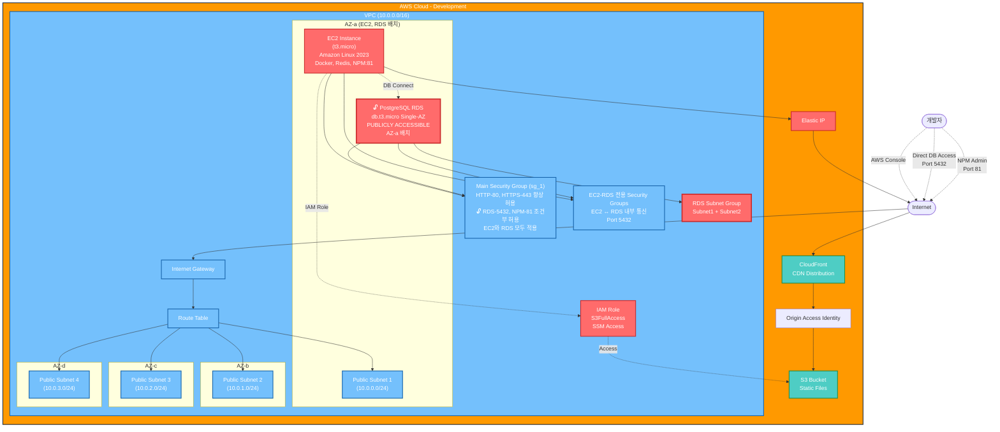

# Re-Life Infrastructure
AWS 기반 인프라 관리 및 배포를 위한 Terraform 코드와 관련 문서입니다.

> ***시작하기 전..***
> * 해당 설정은 개인 AWS 계정에서 진행하는 것을 권장합니다.
> * 기존에 동일한 AWS Access ID 및 Secret Key를 사용하는 경우, 기존에 생성된 리소스에 영향을 줄 수 있습니다.
> * 개인 계정으로 진행하면서 생기는 비용 발생에 대해서 책임을 지지 않습니다.

## Prerequisites
- AWS CLI 설치 및 구성
- [Terraform](https://www.terraform.io/downloads.html) 설치

## Structure
### - Diagram
```
infra/aws/terraform
├── main.tf                   # Terraform 메인 설정 및 프로바이더
├── variables.tf              # Terraform 변수 정의
├── network.tf                # VPC, Subnet, IGW, Route Table 정의
├── security_groups.tf        # Security Groups 정의
├── ec2.tf                    # EC2 Instance, IAM 정의
├── rds.tf                    # RDS Database 정의
├── s3.tf                     # S3 Bucket 정의
├── cloudfront.tf             # CloudFront CDN 정의
├── outputs.tf                # Terraform 출력 값 정의
├── terraform.tfvars.default  # Terraform 변수 값 (복사 후 terraform.tfvars로 사용)
└── ec2_user_data.tpl         # EC2 초기화 스크립트 템플릿
```

## Infrastructure Diagrams

<details>
<summary> 환경 구성도 </summary>

> **주의**: 개발 목적으로 RDS 포트(5432)와 NPM 관리 포트(81)가 외부에 노출되어 있습니다.



**현재 설정값 (variables.tf):**
- PORT
  - `expose_rds_port = true` 🔓
  - `expose_npm_config = true` 🔓
- RDS 외부 접근
  - `publicly_accessible = true`

**프로덕션 권장 설정값:**
- `expose_rds_port = false` 🔒
- `expose_npm_config = false` 🔒
- `publicly_accessible = false` (RDS)

</details>

## Variables Configuration

### - terraform.tfvars 설정 가이드

`terraform.tfvars.default` 파일을 복사하여 `terraform.tfvars` 파일을 생성한 후, 아래 변수들을 설정하세요.

#### 필수 변수
| 변수명 | 설명 | 예시                          |
|--------|------|-----------------------------|
| `github_token_owner` | GitHub 패키지 소유자 계정명 | `"your-github-username"`    |
| `github_token` | GitHub Personal Access Token (read:packages 권한) | `"ghp_xxxxxxxxxxxx"`        |
| `region` | AWS 리전 | `"us-east-1"`               |
| `default_password` | 서비스 기본 비밀번호 | `"your-secure-password"`    |
| `s3_bucket_name` | S3 버킷 이름 (전역 고유) | `"your-unique-bucket-name"` |
| `db_name` | PostgreSQL 데이터베이스 이름 | `"your_db_name"`            |
| `db_username` | 데이터베이스 사용자명 | `"db_user"`                 |
| `nginx_admin_email` | Nginx Proxy Manager 관리자 이메일 | `"admin@example.com"`       |

> ⚠️ **보안 주의사항**
> * 해당 파일은 민감한 정보를 포함합니다
> * 절대 Git 저장소에 커밋하지 마세요
> * 외부로 유출되지 않도록 주의하세요

### - variables.tf 설정 가이드
#### 보안 토글 변수
| 변수명                  | 기본값     | 설명                       |
|----------------------|---------|--------------------------|
| `expose_rds_port`    | `true`  | RDS 포트를 외부에 개방합니다.       |
| `expose_npm_config`  | `true`  | NPM 포트를 외부에 개방합니다.       |
| `bucket_key_enabled` | `false` | false 시 기본 암호화가 적용됩니다.   |
| `is_s3_private`      | `true`  | 외부와 S3 간 상호작용 여부를 결정합니다. |
| `enable_s3_acl`      | `false` | S3 버킷 ACL 활성화 여부를 결정합니다. |


## Usage
#### 1. AWS 자격 증명 설정
    * AWS CLI를 통해 자격 증명을 설정합니다.
    * `aws configure` 명령어를 사용하거나 환경 변수를 설정할 수 있습니다.

#### 2. `terraform.tfvars` 파일 설정
위의 **Variables Configuration** 섹션을 참고하여 필수 변수들을 설정하세요.

#### 3. 터미널
```terraform
# infra/aws/terraform 디렉토리에서 진행

# 초기화
terraform init

# 인프라 구성 검토
# terraform plan

# 인프라 구성 적용
# 'yes' 입력 시 구성 시작
terraform apply

# 리소스 삭제
# 'yes' 입력 시 리소스 삭제 시작
terraform destroy
```

#### 4. `terraform apply` 완료 이후
* EC2 인스턴스에 접속(대시보드 Session Manager로 접속 권장)하여 어플리케이션 설정
  * ghcr.io 로그인 확인
  * Redis 확인
  * NPM 확인 (NPM 콘솔 접속이 안 되는 경우, `variables.tf` 파일 - `expose_npm_config` 변수 확인)
* CD 스크립트 실행

## 리소스 관리

### 💰 비용 절약 팁
* 개발 완료 후 `terraform destroy`로 모든 리소스 삭제
* EC2는 사용하지 않을 때 중지하여 비용 절약 (단, EIP 비용은 발생)
* RDS는 중지해도 7일 후 자동 시작됨

### 🆘 응급 대처
**모든 리소스 삭제**:
```bash
terraform destroy
```

**특정 리소스만 재생성**:
```bash
# 예: EC2만 재생성
terraform destroy -target=aws_instance.main
terraform apply -target=aws_instance.main
```

## 문제해결 (Troubleshooting)

### 🔧 일반적인 문제

<details>
<summary><b>terraform apply 실패 - 권한 오류</b></summary>

**증상**: `AccessDenied` 또는 권한 관련 오류

**해결방법**:
1. AWS CLI 설정 확인: `aws sts get-caller-identity`
2. IAM 사용자에게 다음 권한 필요:
   * EC2FullAccess
   * RDSFullAccess
   * S3FullAccess
   * CloudFrontFullAccess
   * IAMFullAccess
   * VPCFullAccess

   or
   * AdministratorAccess

</details>

<details>
<summary><b>RDS 연결 실패</b></summary>

**증상**: 애플리케이션에서 데이터베이스 연결 오류

**해결방법**:
1. Security Group 확인 - RDS 포트(5432) 허용 여부
2. `expose_rds_port = true` 설정 확인 (개발 환경)
3. RDS 엔드포인트 주소 확인: AWS 콘솔 → RDS → 데이터베이스

</details>

<details>
<summary><b>NPM 콘솔 접속 불가</b></summary>

**증상**: Nginx Proxy Manager 관리 페이지 접속 안됨

**해결방법**:
1. `expose_npm_config = true` 설정 확인
2. Security Group에서 포트 81 허용 여부 확인
3. EC2 Public IP:81로 접속 시도
4. 초기 로그인 정보:
   * Email: `nginx_admin_email` 설정값
   * Password: `default_password` 설정값

</details>

<details>
<summary><b>S3 버킷 이름 충돌</b></summary>

**증상**: `BucketAlreadyExists` 오류

**해결방법**:
* `s3_bucket_name`을 전역에서 고유한 이름으로 변경
* 예: `relife-your-name-20250929`

</details>

<details>
<summary><b>GitHub Package Registry 인증 실패</b></summary>

**증상**: EC2에서 ghcr.io 로그인 실패

**해결방법**:
1. GitHub Token 권한 확인: `read:packages` 필요
2. Token 유효성 확인: 만료되지 않았는지 점검
3. EC2에서 수동 로그인 시도:
   ```bash
   echo $GITHUB_TOKEN | docker login ghcr.io -u $GITHUB_USERNAME --password-stdin
   ```
4. 로그인 확인:
   ```bash
   cat ~/.docker/config.json | jq '.auths'
   
   # 출력 예시:
   # {
   #    "ghcr.io": {
   #      "auth": "base64-encoded-auth-string"
   #     }
   # }
   ```

</details>

## 보안 고려사항

### 🔒 프로덕션 환경 권장 설정
```hcl
# terraform.tfvars
expose_rds_port = false      # RDS 외부 접근 차단
expose_npm_config = false    # NPM 관리 페이지 내부 전용
```

### 🛡️ 보안 체크리스트
- [ ] terraform.tfvars 파일이 .gitignore에 포함되어 있는가?
- [ ] GitHub Token이 최소 권한(read:packages)만 가지고 있는가?
- [ ] 프로덕션에서 RDS 외부 접근이 차단되어 있는가?
- [ ] 강력한 패스워드를 사용하고 있는가?
- [ ] 불필요한 Security Group 규칙이 없는가?

마지막 수정일: 2025-09-29